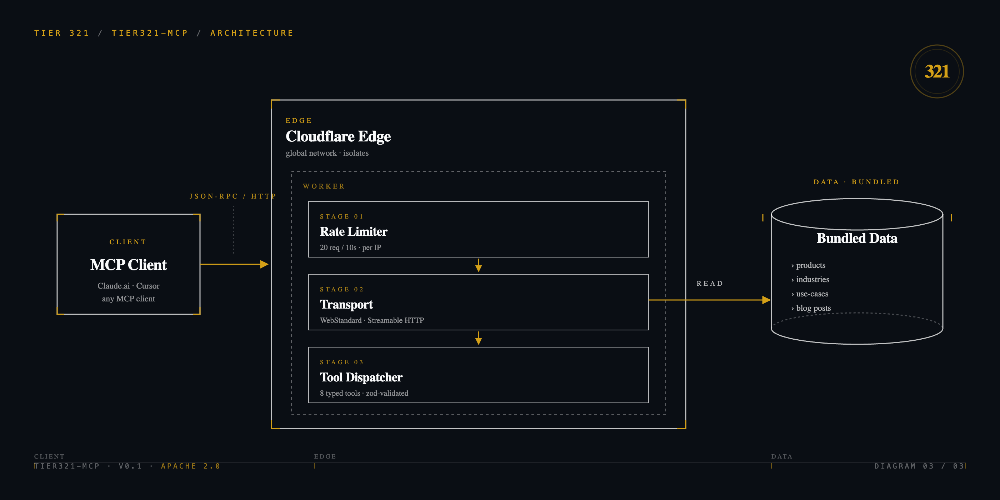

# tier321-mcp

[](https://github.com/jv-tier321/tier321-mcp/actions/workflows/ci.yml)
[](./LICENSE)
[](https://github.com/jv-tier321/tier321-mcp/releases)
[](https://spec.modelcontextprotocol.io/)
[](https://workers.cloudflare.com/)
[](./CONTRIBUTING.md)

A reference implementation of a [Model Context Protocol](https://spec.modelcontextprotocol.io/) server on [Cloudflare Workers](https://workers.cloudflare.com/). Eight read-only tools, anonymous access, per-IP rate limiting, tested under miniflare. This is the code that backs [`mcp.tier321.com/mcp`](https://tier321.com/resources/blog/shipping-mcp-tier321-com) in production, scrubbed of organization-specific data.

## Features

- **Streamable HTTP transport** (`WebStandardStreamableHTTPServerTransport`) — the web-standard variant, not the Node-specific one. Workers have no Node streams.
- **Workers-compatible JSON Schema validation** via `CfWorkerJsonSchemaValidator` from the MCP SDK. AJV can't `require()` JSON under the V8 isolate; the SDK ships a wrapper that uses `@cfworker/json-schema` under the hood.
- **Per-IP rate limiting** via Cloudflare's Workers Rate Limiting binding (20 req / 10 s, configurable).
- **Miniflare-backed tests** with `@cloudflare/vitest-pool-workers` — no deployed worker required for the full test suite.
- **Apache 2.0** — fork, deploy, extend.

## How it works



An MCP client (Claude.ai, Cursor, any MCP client) makes a JSON-RPC call over HTTP to the Worker. The Worker pipeline is three stages:

1. **Rate Limiter** — reads `CF-Connecting-IP`, checks against the `MCP_RATE_LIMITER` binding (20 req / 10 s per IP). On exceed, returns a JSON-RPC error envelope with code `-32000`.
2. **Transport** — `WebStandardStreamableHTTPServerTransport` parses the JSON-RPC request, hands it to the registered server.
3. **Tool Dispatcher** — the server routes to one of eight `registerTool`-registered handlers. Each handler validates its input via Zod and returns a `content[0].text` JSON string.

The data a tool returns is bundled at build time (no filesystem access under the V8 isolate). Blog posts are `.mdx` files imported as raw text via Wrangler's `rules: [{ type: "Text" }]` rule.

## Tools

| Tool | Input | Returns |
|---|---|---|
| `get_company_info` | — | Company description and positioning |
| `list_products` | `status?: ProductStatus[]` | Products matching optional status filter |
| `get_product` | `id: string` | A single product by id |
| `list_blog_posts` | — | Blog post metadata (sorted newest-first by date) |
| `get_blog_post` | `slug: string` | Full blog post body + metadata |
| `list_industries` | — | Industry catalog |
| `list_use_cases` | — | Use-case catalog |
| `get_contact_methods` | — | Ways to reach the organization (read-only) |

## Quickstart

Requires Node 20 or 22, and a Cloudflare account if you want to deploy.

```bash
git clone https://github.com/jv-tier321/tier321-mcp.git
cd tier321-mcp
npm install
npm test                     # miniflare-backed vitest
npm run typecheck            # tsc --noEmit
npm run verify:parity        # shape-check the bundled data
npx wrangler deploy --dry-run --outdir=./dist   # no deploy, just build check
```

To deploy your own instance, copy `.env.example` to `.env`, fill in your Cloudflare credentials, edit `wrangler.jsonc` to set your domain, and run `npx wrangler deploy`.

## Making it yours

The bundled product, industry, use-case, and blog data in `src/data/` is placeholder. Replace it with your own using the same TypeScript shapes. Tests enforce counts (8 products, 8 industries, 4 use-cases, at-least-one blog post) — if you use different counts, update the matching assertions in `test/tools.test.ts`.

The `scripts/verify-parity.ts` script is a shape-only checker — it confirms your data has the expected counts and required fields. In the production deployment that backs `mcp.tier321.com`, this script did a cross-repo parity check against a sibling main-site source of truth. The public reference simplifies that to shape-only because the cross-repo pattern isn't useful without a specific sibling repo.

## Reference deployment

This code runs in production at [`mcp.tier321.com/mcp`](https://mcp.tier321.com/mcp). For the story of why and how we shipped it, see the [launch blog post](https://tier321.com/resources/blog/shipping-mcp-tier321-com) on `tier321.com`.

## Contributing

See [CONTRIBUTING.md](./CONTRIBUTING.md) for development setup and PR process. Security issues: see [SECURITY.md](./SECURITY.md) for our disclosure path.

## License

Apache 2.0. See [LICENSE](./LICENSE) and [NOTICE](./NOTICE).
