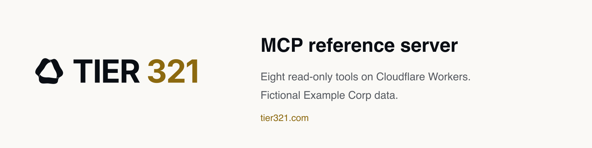

# tier321-mcp

[](https://github.com/jv-tier321/tier321-mcp/actions/workflows/ci.yml)
[](https://github.com/jv-tier321/tier321-mcp/actions/workflows/codeql.yml)
[](https://github.com/jv-tier321/tier321-mcp/releases)

A public reference [Model Context Protocol](https://modelcontextprotocol.io/) server on Cloudflare Workers. Eight anonymous, read-only tools expose bundled **fictional Example Corp data**. This repository is distinct from the separately maintained `mcp.tier321.com` production deployment; a release here does not update that service.

## Quickstart

Use a current patched Node **22 or 24** release. A Cloudflare account is unnecessary for local tests.

```sh
git clone https://github.com/jv-tier321/tier321-mcp.git
cd tier321-mcp
npm ci --ignore-scripts
npm run check
npm run audit
npm run dev
```

Local development binds to `127.0.0.1:8787`. Connect an MCP client using Streamable HTTP at `http://127.0.0.1:8787/mcp`. Native clients omit the `Origin` header. For a browser client, set `vars.MCP_ALLOWED_ORIGINS` in `wrangler.jsonc` to its exact origin, such as `https://your-client.example`; separate multiple origins with commas. The default empty list denies all browser-origin requests. Do not add wildcards, `null`, paths or trailing slashes.

For a protocol smoke check:

```sh
curl http://127.0.0.1:8787/mcp \
  -H 'Content-Type: application/json' \
  -H 'Accept: application/json, text/event-stream' \
  -d '{"jsonrpc":"2.0","id":1,"method":"initialize","params":{"protocolVersion":"2025-11-25","capabilities":{},"clientInfo":{"name":"quickstart","version":"1"}}}'
```

## Tools and public exposure

| Tool | Input | Result |
|---|---|---|
| `get_company_info` | none | Company description as plain text |
| `list_products` | `status?: ProductStatus[]`, at most four | Matching products as JSON text |
| `get_product` | `id`, 1–128 characters | Product as JSON text |
| `list_blog_posts` | none | Metadata sorted newest-first, as JSON text |
| `get_blog_post` | `slug`, 1–128 characters | Full markdown body and metadata as JSON text |
| `list_industries` | none | Industry catalog as JSON text |
| `list_use_cases` | none | Use-case catalog as JSON text |
| `get_contact_methods` | none | Contact channels as JSON text; no submission |

All tools advertise read-only, non-destructive, idempotent and closed-world annotations. These are client hints; actual safety comes from the handlers using only fixed bundled data. Unknown records return `isError` text. Slugs and IDs never become filesystem paths or outbound URLs.

Everything you add to these catalogs or imported blog posts becomes anonymously readable, including full markdown bodies. Do not include secrets, private customer records, unpublished material or internal notes. MDX is imported as text, not executed. No database, OAuth, storage, email sending or outbound fetch integration exists.

## Request contract

- `POST /mcp`: one JSON-RPC object; JSON responses with no persistent session. Initialization supports protocol negotiation through the MCP SDK. A missing later protocol header uses the SDK compatibility default.
- `OPTIONS /mcp`: preflight for approved origins. `GET` and other methods return `405` with `Allow: POST, OPTIONS`; standalone SSE and DELETE sessions are unsupported. Other paths return `404`.
- Send `Content-Type: application/json` and `Accept: application/json, text/event-stream`. Content encodings and batches are rejected.
- Actual streamed body limit: **16 KiB**, total body-read timeout: **5 seconds**, maximum JSON nesting: **32 levels**. Oversized requests receive `413`; read timeouts receive `408`; invalid JSON/messages receive `400`.
- Cloudflare rate-limit binding: **20 HTTP requests per 10 seconds per IP per Cloudflare location**, with `429` and `Retry-After: 10`. Counters are eventually consistent, not a strict global quota. The Worker fails closed if the binding fails. Keep the response retry interval aligned with the binding period when customizing it.
- Origin is checked against the explicit allowlist; invalid origins receive `403`. It is not authentication. Public native clients can access all content.
- Responses use `Cache-Control: no-store`, `X-Content-Type-Options: nosniff` and `Vary: Origin`. Unexpected exceptions produce a generic response and fixed log event, without request bodies or exception text.

See [architecture and trust boundaries](docs/ARCHITECTURE.md), [security policy](SECURITY.md), and [enhancements for discussion](docs/ENHANCEMENTS.md).

## Customize and deploy your own instance

1. Replace the fictional catalogs in `src/data/`, company/contact constants in `src/tools/`, and explicit blog imports in `src/lib/blog-loader.ts`. Review all returned fields for public suitability.
2. Keep data shapes consistent. `verify:parity` is a local shape/count check, not synchronization with another repository. Update its fixture and tests when changing counts.
3. Set a unique Worker name and rate-limit namespace in `wrangler.jsonc`. Add your custom domain if needed, and configure approved browser origins.
4. Run `npm run types`, `npm run check`, and `npm run audit`.
5. Authenticate with `npx wrangler login` using your own Cloudflare account, then run `npm run deploy`. For noninteractive deployment, use a narrowly scoped token in your secret manager/environment. Never put a token into source or Worker variables.

GitHub CI and release jobs do not receive Cloudflare credentials or deploy a Worker. Release assets contain the dry-run bundle, placeholder data, licenses and version, with SHA-256 checksums; source maps are excluded. See [CONTRIBUTING.md](CONTRIBUTING.md) for checks and release instructions.

## License

Apache 2.0. See [LICENSE](LICENSE) and [NOTICE](NOTICE).
