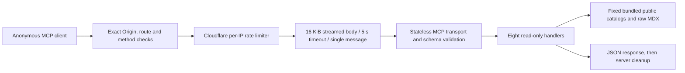

# Architecture and security boundaries

This describes public reference version 0.2.0. The separately operated `mcp.tier321.com` service is outside this repository's release and validation scope. The diagram and contracts below describe the current implementation.

The [public POC boundary](PUBLIC_POC.md) defines what may be published and how the demonstration stays separate from private TIER 321 systems. Catalog descriptions are fictional examples; they do not confer the integrations or permissions they describe. Public architecture documents cover this reference implementation and omit account-specific deployment records.

## Components and resources

| Component | Source | Boundary and effective behavior |
|---|---|---|
| HTTP entry point | `src/index.ts` | Anonymous POST `/mcp`; exact configured Origin allowlist, route/method checks, binding admission and generic failures |
| Body reader | `src/lib/request.ts` | Counts actual streamed bytes before parsing, 16 KiB maximum, five-second total read deadline, one object and bounded nesting |
| Server factory | `src/server.ts` | Fresh server and transport per request; package-derived version; explicit `CfWorkerJsonSchemaValidator` |
| Tool registration | `src/tools/` | Zod argument bounds, fixed equality lookups and static reads; annotations are descriptive hints |
| Blog loader | `src/lib/blog-loader.ts` | Two explicitly imported MDX files parsed as text; minimal frontmatter parsing occurs at runtime; no caller-controlled path or MDX evaluation |
| Worker configuration | `wrangler.jsonc` | Worker name, account-scoped limiter namespace, empty default origin list, loopback development bind and observability |
| Schema adapters | `test/__stubs__/` | AJV aliases apply to production as well as tests. Runtime validation uses CfWorker, avoiding unsupported AJV import/evaluation behavior |
| Data checker | `scripts/verify-parity.ts` | Author-time Node script reads a fixed local fixture; checks counts/fields, not upstream parity |

The only platform binding called by runtime code is `MCP_RATE_LIMITER`. No runtime credentials, storage bindings, external network calls, private resources or write tools are configured. `CF-Connecting-IP` is trusted only behind Cloudflare ingress; missing headers use a shared `unknown` bucket. Local/test callers can supply headers and do not establish production ingress behavior.

## Threat model

Assets are Worker availability, intentional public-data boundaries, repository/release integrity and operator credentials. An anonymous attacker controls request headers and bodies and can enumerate all public tools. That grants no repository, Cloudflare deployment, filesystem or outbound-request authority.

The limiter counts `POST /mcp` requests that pass Origin, route and method checks. Other paths, `OPTIONS`, unsupported methods and rejected origins return before the limiter. The body reader independently bounds work per admitted request. Arrays are rejected before the SDK, preventing batch amplification; bounded IDs/slugs and status arrays limit reflected or validation work. The body reader does not trust Content-Length alone. A fresh server is closed after its complete JSON response; no session map persists across requests.

CORS is not authorization. Explicit Origin checks prevent arbitrary browser-origin use of a locally running instance. Native callers without Origin remain supported because this catalog is intentionally public. Bind local development only to loopback. Do not add private data or write operations without an authenticated, scoped authorization design and new tests.

Rate counters are eventually consistent and local to a Cloudflare location. They do not guarantee a global spending cap or protection against all distributed traffic. Operators must choose platform CPU/billing controls appropriate to their deployment. Public error bodies are generic; the application logs only a fixed unexpected-error event. Cloudflare observability redacts request query strings from logs and traces; other platform request metadata may be retained.

## Build and release trust

CI uses full-commit action pins, read-only repository permissions, checkout without persisted credentials, and `npm ci --ignore-scripts`. It tests Node 22/24, types, data shape, release metadata and all npm advisory severities. CodeQL checks JavaScript/TypeScript on PRs, main and weekly. GitHub settings such as required checks, secret scanning and vulnerability reporting are external controls and must be verified separately.

A `vX.Y.Z` tag starts a read-only release build job. It verifies main ancestry, tag/package/lockfile/changelog consistency, dependencies, tests and Worker bundling. The packaging script accepts only regular approved bundle files and excludes source maps. It emits a tar archive and SHA-256 checksum, then uploads them as a workflow artifact.

A separate publish job downloads the artifact from that run, verifies its checksum and creates the GitHub Release. Only that job gets `contents: write`; it does not check out or execute repository code or run npm. There is no Cloudflare deployment in this workflow. Checksums detect accidental artifact corruption; they are not independent provenance or a substitute for reviewing the producing workflow.

## Dependencies and compatibility

The compatibility date is 2026-08-22, the newest date supported by the current Cloudflare test-pool runtime. This keeps tests and the configured behavior aligned.

Runtime: MCP SDK 1.30.0, Zod 4.6.5 and CfWorker JSON Schema 4.1.1. Development dependencies are pinned with an integrity-locked install. Vitest remains on 4.1.11 because Cloudflare pool 0.22.0 declares a Vitest 4 peer requirement. Dependabot major-version updates for Vitest are temporarily ignored; remove that rule when the pool supports Vitest 5 and validate the upgrade together. Sharp 0.35.4 is explicitly overridden to remediate the pool's older transitive development dependency; remove the override when upstream resolves to a patched version. No image-processing tool is exposed by the Worker.

## Validation scope

The named `staging` environment isolates live validation in `tier321-mcp-staging`, with an explicit empty browser-origin list, its own limiter namespace, no custom routes and version preview URLs disabled. It exposes only this repository's public example data through its Worker-specific `workers.dev` address. The default Worker and separately maintained production service are not staging deployment targets. See [deployment and live validation](DEPLOYMENT.md) for operator commands, evidence and rollback limits.

Tests run against Miniflare and the actual Worker/SDK: eight tools, rate limits, initialization, notifications, invalid protocols, media types, malformed/oversized/streamed bodies, batch rejection, argument bounds, origin policy and sanitized errors. Build and release packaging are local checks. They do not prove the configuration or availability of another deployment.
